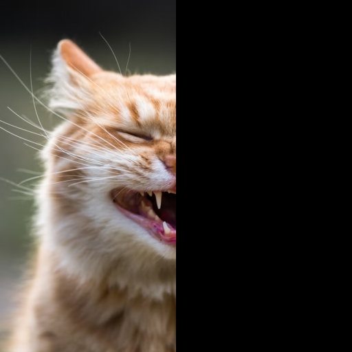
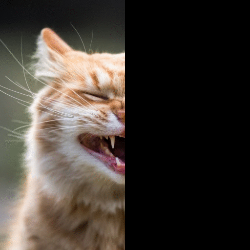
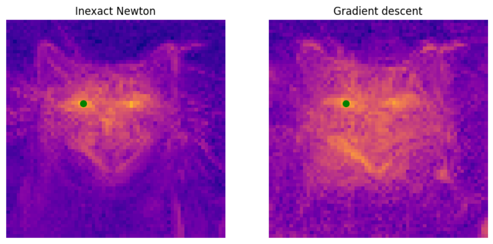

# Fast constrained sampling in pre-trained diffusion models [NeurIPS 2025]

[[arXiv]](https://arxiv.org/abs/2410.18804)

We introduce a new algorithm for sampling with novel constraints from pre-trained diffusion models.

Instead of performing gradient descent steps (see [DPS](https://dps2022.github.io/diffusion-posterior-sampling-page/)), which require expensive backward passes through the denoiser network we propose using **Inexact Newton** steps, that can be done with just forward passes and produce as good results.

| Masked image | Inpainting using Stable Diffusion (~15s) |
| - | - |
|  |  |

## Inference
We provide two implementations of the proposed inexact Newton sampling algorithm for linear and non-linear tasks:

- In `stable-diffusion` we provide an implementation based on the [LDM repository](https://github.com/CompVis/stable-diffusion).
  - `inpaint.ipynb` performs inpainting on a given image and mask.
  - `superres.ipynb` performs super-resolution on an image and a given downsampling rate.
  - `style.ipynb` generates an image from a given caption, following the style provided in the reference image. We utilize the second layer features from a CLIP ViT-B/16 to compare the style between the generated and reference images.
 
- In `diffusers` we provide an implementation using the [diffusers](https://huggingface.co/docs/diffusers/index) library.
  - `inpaint.ipynb` performs inpainting on a given image and mask.

We have also experimented with rectified flow models (e.g. Instaflow, Stable Diffusion 3). The extension is straightforward and we will be adding a code implementation for such models as well.

## Analysis

### Inexact vs exact Newton


In `mnist/train_diffusion.ipynb` we showcase the comparison between the inexact ($Je$), exact ($J^{-1}e$), and gradient descent ($J^Te$) directions for enforcing constraints during sampling. 
This is done on the MNIST dataset where computing the Jacobian is tractable. Even then, inverting the Jacobian to compute the exact Newton step requires some tuning and we utilize `scipy.linalg.lstsq' to find a suitable solution.

### Inexact Newton vs Gradient descent


In `stable-diffusion/jacobian_exact_vs_gd.ipynb` we demonstrate the qualitative differences between the proposed inexact Newton step and gradient descent.
Theoretically, the denoiser Jacobian should be symmetric, making the two update directions equivalent. In practice, we find fundamental differences between the two directions. The inexact Newton direction retains shapes better and shows stronger global coherency.

## Inexact Newton for VAEs
In `stable-diffusion/superres_vae_newton.ipynb` we show an implementation of super-resolution that also avoids backpropagating through the Stable Diffusion decoder using a second Newton approximation in the VAE space.
This is a central idea of our paper [ZoomLDM](https://github.com/cvlab-stonybrook/ZoomLDM), where backpropagating through the VAE is prohibitive due to memory constraints.


## Bibtex

```
@article{graikos2024fast,
  title={Fast constrained sampling in pre-trained diffusion models},
  author={Graikos, Alexandros and Jojic, Nebojsa and Samaras, Dimitris},
  journal={arXiv preprint arXiv:2410.18804},
  year={2024}
}
```
